# AWS-Solution-Architech-Learning

_**Region**_ - A region is a geographical area with at least two availability zones in it, and each region is isolated from other AWS Regions. There are about 23 of them around the world at the moment, which changes all the time. So by the time you read this, you may find that there are 24 or 25 regions.

_**Availability zones:**_ - Then, we have availability zones (AZ). A region will have at least two availability zones within it; however, sometimes, they have five or more. An availability zone comprises one or more data centers, and these are physically separated from other availability zones. That being said, they’re connected with low latency, highly available, and high bandwidth links. You can deploy your resources within a region but into separate availability zones for high availability and redundancy. This means that if there’s an outage on one availability zone, your resources in the other ones won’t be affected. You’ve got networking connectivity between all of the AZs as well.

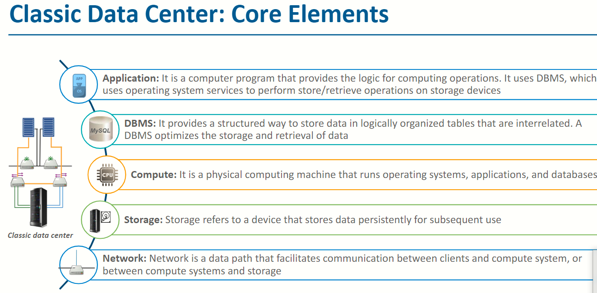
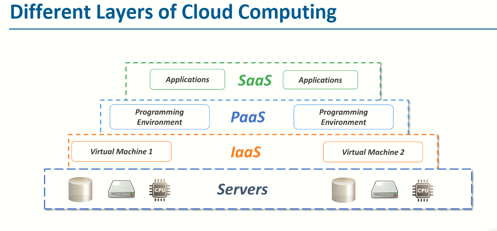
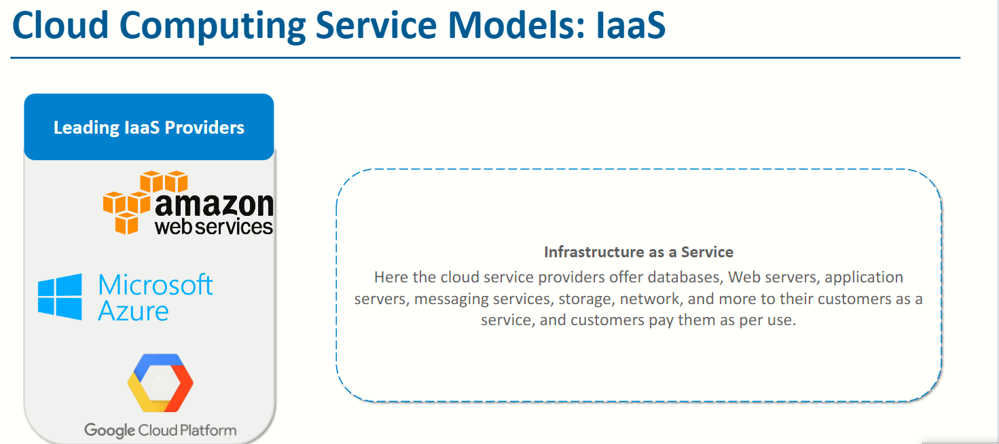
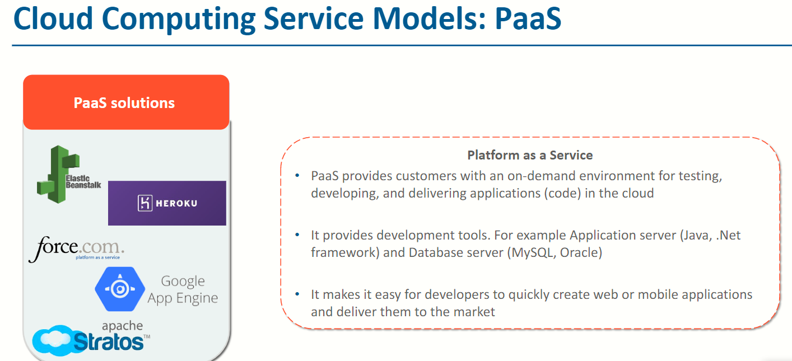
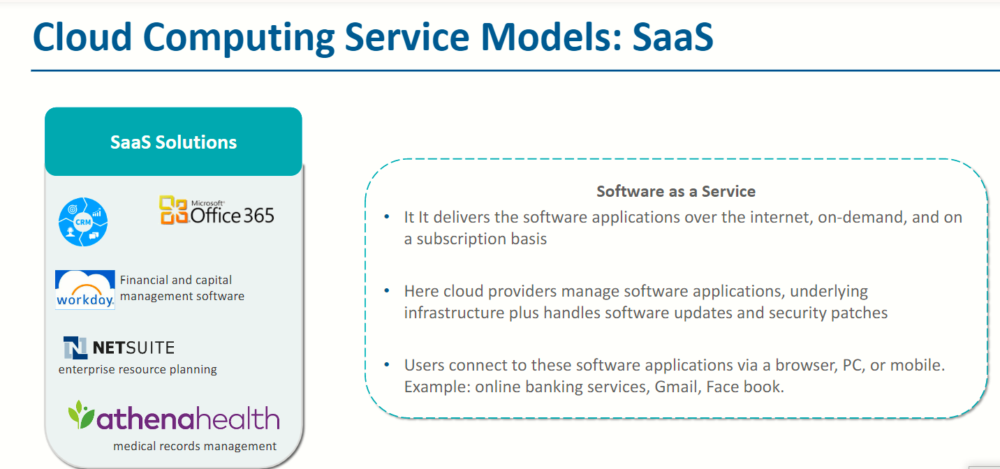
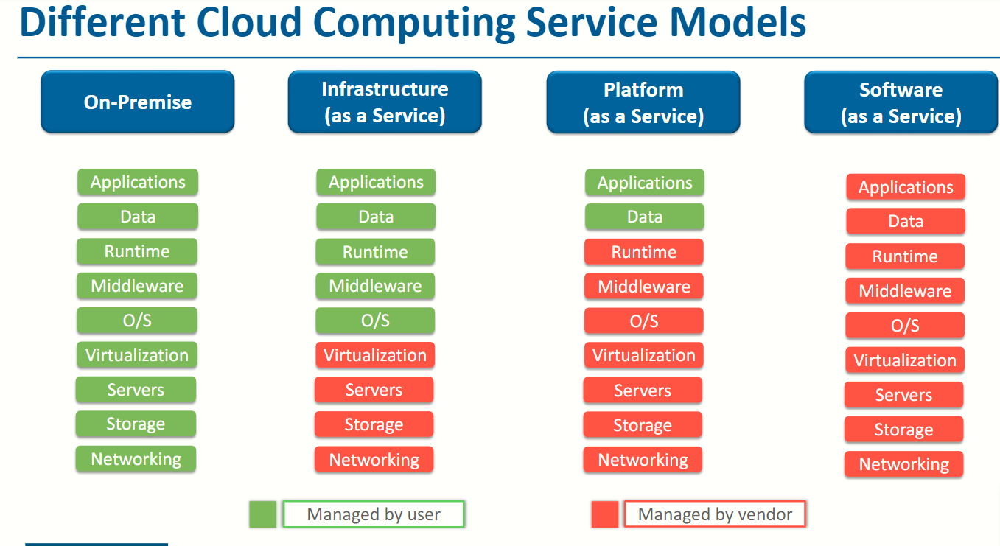
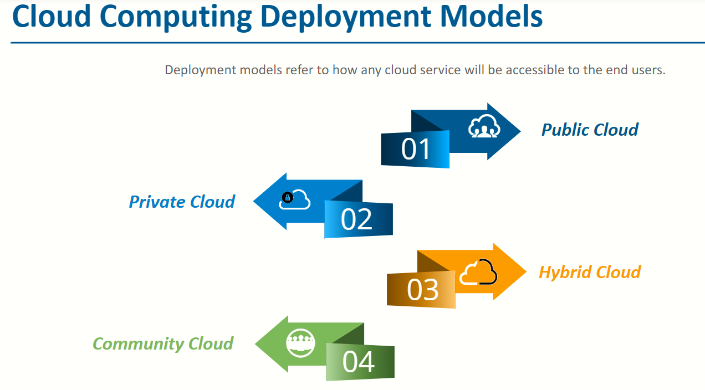
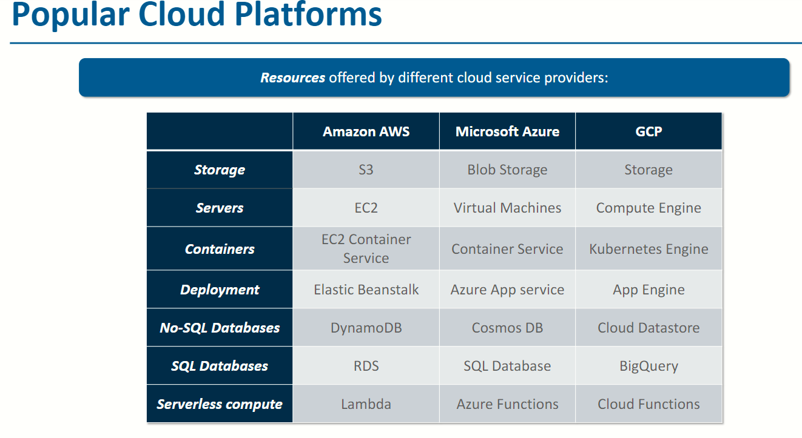
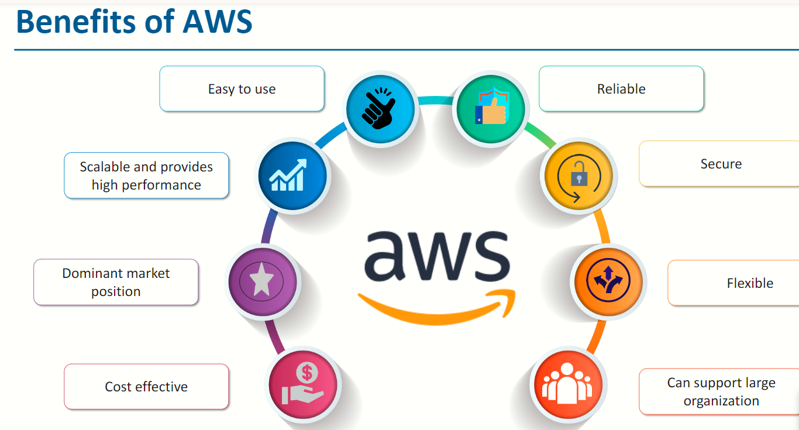

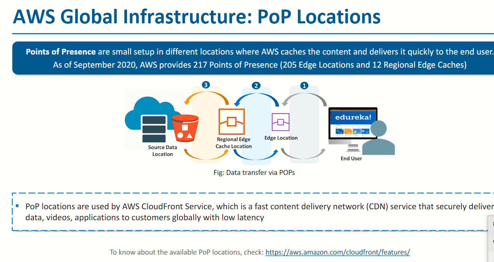
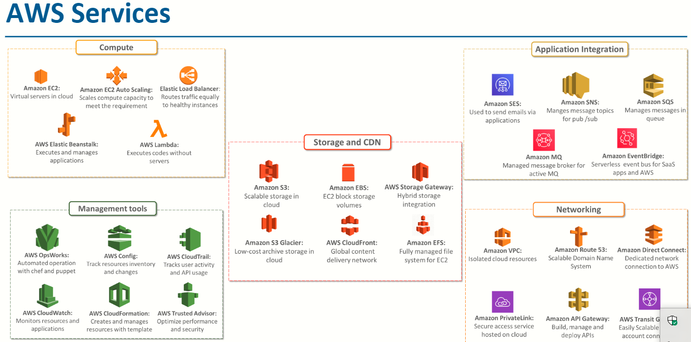
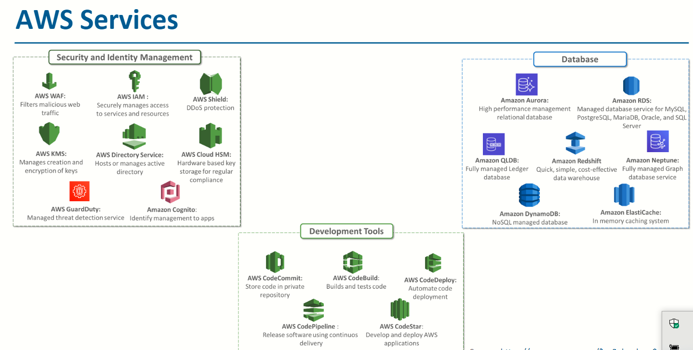
